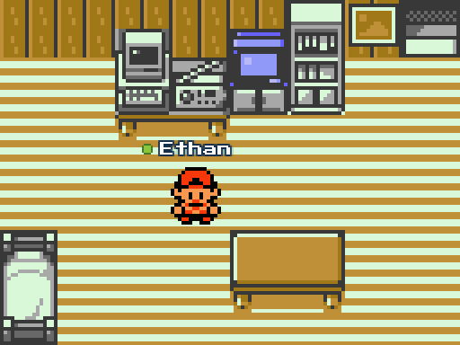

# Pokémon Gold Adventure



This is a [WorkAdventure](https://workadventu.re/) world based on the Game Boy game [Pokemon Gold](https://en.wikipedia.org/wiki/Pok%C3%A9mon_Gold_and_Silver "Wikipedia") maps.

# Progress

Here is the list of all the maps by walkthrough order:

## Johto

- [] New Bark Town
- [] Route 29
- [] Cherrygrove City
- [] Mr. Pokémon's House
- [] Back to New Bark Town
- [] Routes 30 & 31
- [] Dark Cave
- [] Violet City
- [] Sprout Tower
- [] Route 32
- [] Ruins of Alph
- [] Union Cave
- [] Route 33
- [] Azalea Town
- [] Slowpoke Well
- [] Ilex Forest
- [] Route 34
- [] Goldenrod City
- [] Route 35
- [] National Park
- [] Routes 36 & 37
- [] Ecruteak City
- [] Burned Tower
- [] Route 38 & 39
- [] Olivine City
- [] Lighthouse
- [] Routes 40 & 41
- [] Cianwood City
- [] Olivine Gym & Johto Side Quests
- [] Route 42
- [] Mahogany Town
- [] Route 43
- [] Lake of Rage
- [] Rocket Hideout
- [] Radio Tower
- [] Return to Ecruteak City (Crystal)
- [] Route 44
- [] Ice Path
- [] Blackthorn City
- [] Dragon's Den
- [] Mt. Mortar
- [] Whirl Islands
- [] Tin Tower
- [] Routes 45 & 46

## Kanto

- [] Routes 26 & 27
- [] Victory Road
- [] Indigo Plateau
- [] Fast Ship S.S Aqua
- [] Vermilion City
- [] Route 6
- [] Saffron City
- [] Route 7
- [] Route 8
- [] Lavender Town
- [] Rock Tunnel
- [] Routes 9 & 10
- [] Cerulean City
- [] Routes 24 & 25
- [] Route 5
- [] Celadon City
- [] Routes 16, 17 & 18
- [] Fuchsia City
- [] Routes 14 & 15
- [] Routes 12 & 13
- [] Route 11
- [] Diglett's Cave
- [] Route 2
- [] Pewter City
- [] Route 3
- [] Mt. Moon
- [] Route 4
- [] Viridian City
- [] Route 1
- [] Pallet Town
- [] Routes 19, 20 & 21
- [] Viridian Gym
- [] Route 22
- [] Route 28
- [] Mt. Silver

# Installation

```shell
npm install
npm run dev
```

Replace `map.json` in the address bar by the name of the map you want to test.

# Licenses

This project contains multiple licenses as follows:

* [Code license](./LICENSE.code) *(all files except those for other licenses)*
* [Map license](./LICENSE.map) *(`map.json` and the map visual as well)*
* [Assets license](./LICENSE.assets) *(the files inside the `src/assets/` folder)*

# Credits

This is a personal project and it makes no sense to put a licence or credits for official Pokemon assets... 

But let's credit the original game creators anyway:
- Developed by [Game Freak](https://www.gamefreak.co.jp/)
- Published by [Nintendo](https://www.nintendo.com/)
- Pokémon modeling by [Creatures](https://www.creatures.co.jp/)
- Music by [Junichi Masuda](https://en.wikipedia.org/wiki/Junichi_Masuda)
- Licensing by [The Pokémon Company](https://www.pokemon.com/)